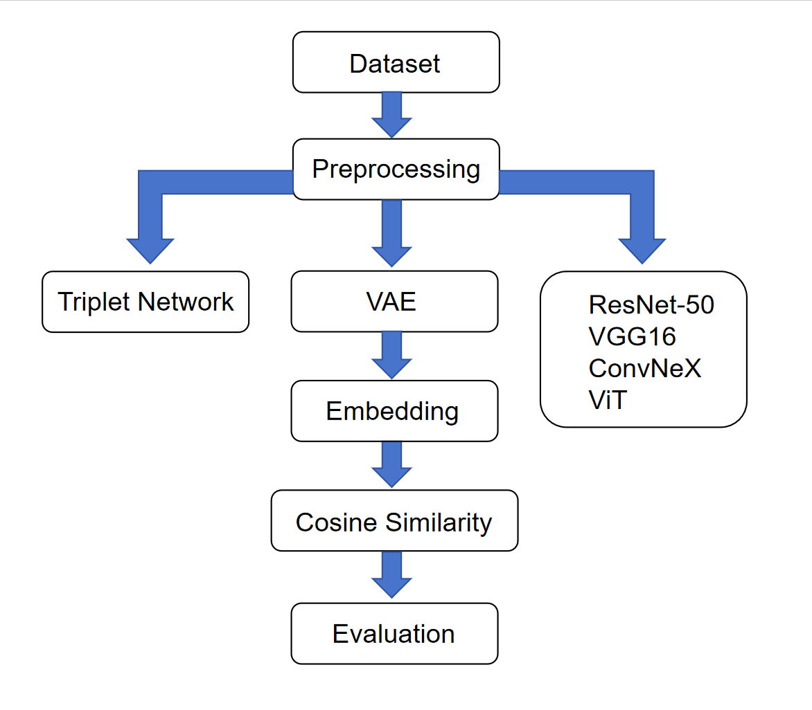
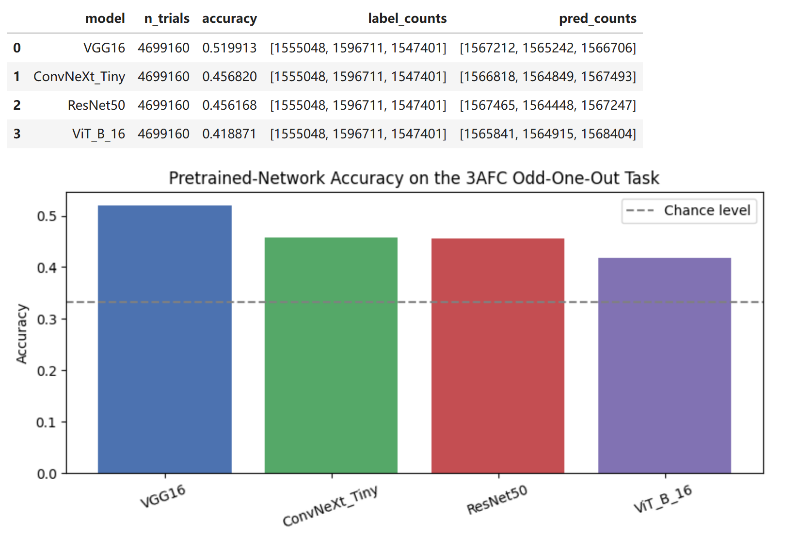
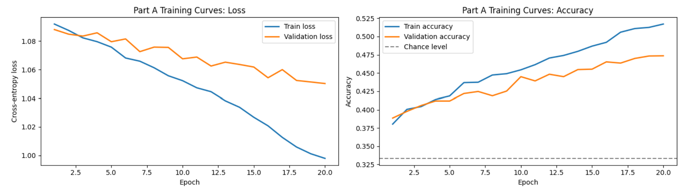
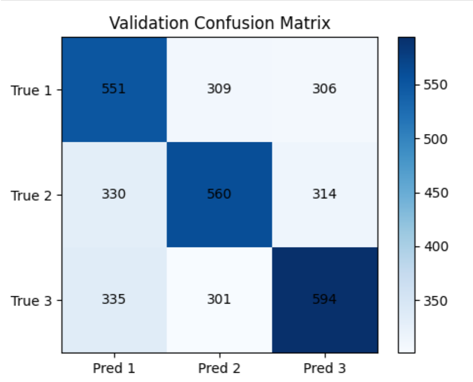
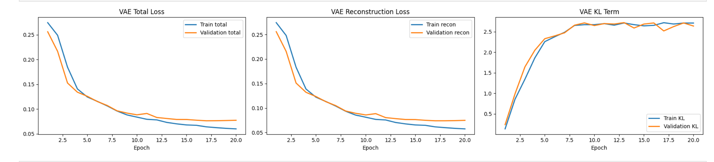

# Deep Learning-based Visual Similarity Modeling System

## Project Overview

This project presents a PyTorch-based framework for image similarity learning and visual representation analysis.

Three different deep learning approaches were implemented and compared:

- **Triplet Network** for metric learning
- **Variational Autoencoder (VAE)** for unsupervised feature learning
- **Transfer Learning** using pretrained models (VGG16, ResNet-50, ConvNeXt, and Vision Transformer)

The learned feature embeddings were evaluated using cosine similarity to compare the performance of different representation learning strategies on an odd-one-out visual similarity task.

---

## Project Workflow



---

## Key Features

- Implemented three representative deep learning approaches for visual similarity learning.
- Built an end-to-end PyTorch training and evaluation pipeline.
- Compared metric learning, unsupervised learning, and transfer learning under the same task.
- Extracted feature embeddings and evaluated image similarity using cosine similarity.
- Compared multiple pretrained architectures including VGG16, ResNet-50, ConvNeXt, and Vision Transformer.

---

## Technical Stack

| Category | Technologies |
|----------|--------------|
| Programming Language | Python |
| Deep Learning | PyTorch |
| Computer Vision | VGG16, ResNet-50, ConvNeXt, Vision Transformer (ViT) |
| Representation Learning | Triplet Network, Variational Autoencoder (VAE) |
| Similarity Measurement | Cosine Similarity |
| Data Processing | NumPy, Pandas |
| Visualization | Matplotlib |
| Development Environment | Jupyter Notebook |

---

## Experimental Results

### Transfer Learning

Comparison of four pretrained CNN/Transformer architectures.



| Model | Accuracy |
|--------|---------:|
| VGG16 | 51.99% |
| ConvNeXt | 45.68% |
| ResNet50 | 45.62% |
| ViT | 41.89% |

### Triplet Network

- Successfully learned image embeddings using metric learning.
- Training and validation accuracy increased steadily during training.



### Classification Performance

The confusion matrix illustrates the model's prediction performance on the validation dataset.



---

### Variational Autoencoder

- Learned meaningful latent representations through unsupervised learning.
- Reconstruction loss decreased consistently during optimization.



---

## Project Notebook

The complete implementation and experimental analysis are available in:

- [`notebooks/OOO_odd_one_out.ipynb`](notebooks/final_odd_one_out_report.ipynb)

---

## Repository Structure

```text
Deep-Learning-based-Visual-Similarity-Modeling-System
│
├── README.md
├── images/
│   ├── workflow.png
│   ├── triplet_training_curves.png
│   ├── triplet_confusion_matrix.png
│   ├── transfer_learning_accuracy.png
│   └── vae_training_loss.png
│
├── notebooks/
│   └── OOO_odd_one_out.ipynb
│
└── requirements.txt
```